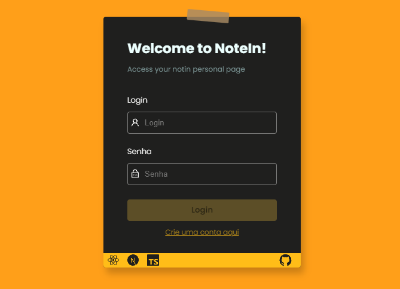

## NoteIn

web app focused on storing notes

### Features

#### 📃 Login Form: you can make a account for access your notes and configure your profile 
#### 🌚 Dark Mode
#### 📃 Auth with MongoDB
#### Note pages for each user

## Preview

## Access

[Open NoteIn](https://notein.vercel.app/)
